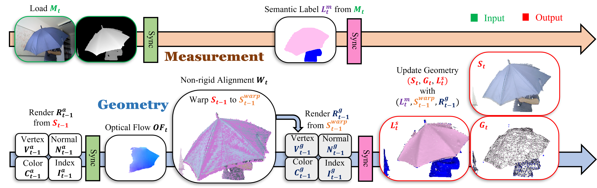

# Mono-STAR: Mono-camera Scene-level Tracking and Reconstruction

## Overview

We present **Mono-STAR**, the first real-time 3D reconstruction system  that simultaneously supports semantic fusion, fast motion tracking, non-rigid object deformation, and topological change under a unified framework.
The proposed system solves a new optimization problem that incorporates  optical-flow-based 2D constraints to deal with fast motion, and a novel semantic-aware deformation graph (SAD-graph) for handling topology change. We test the proposed system under various challenging scenes and demonstrate that it significantly outperforms existing state-of-the-art systems.

## Proposed

Overview of the proposed system. The system runs in two parallel threads, one for measurement and one for geometry. In each time-step $t$, the measurement thread loads a measurement $M_t$ from images or a camera buffer. Then, a segmentation network generates a set of semantic labels $L^m_{t}$. Once the measurement is loaded on the GPU memory, $M_t$ and previous alignment rendering $R^a_{t-1}$ are fed into an optical-flow network to generate the optical-flow $OF_t$ from previous geometry $S_{t-1}$ to measurement $M_t$.  Optical-flow $OF_t$, geometry rendering $R_t$ and measurement $M_t$ are used to compute warp-field $W_t$ with non-rigid alignment. After the alignment, previous geometry $S_{t-1}$ will be warped to $S_{t-1}^{warp}$. The fusion render map $R^g_{t-1}$ is then rendered from $S_{t-1}^{warp}$.  $R^g_{t-1}$, $S_{t-1}^{warp}$ are then combined with semantic labels $L^m_t$ from the measurement thread to generate the updated geometry $S_t$. In the end, a new alignment rendering $R^a_t$ is generated from updated geometry $S_t$ for the processing of the next frame.

## Experiment Results

### Fast Motion

### Deformation

### Topology Change